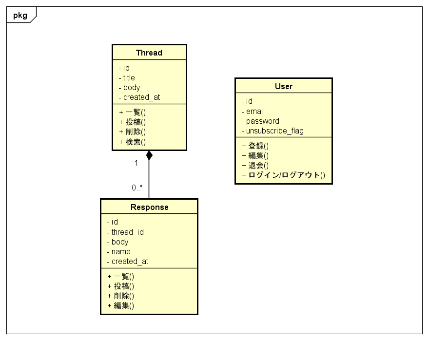

# bulletin_board



## Built-in web server

```
$ cd php_libs/
$ php -S 0.0.0.0:8000
```

```
$ php -v
PHP 7.1.4 (cli) (built: Apr 14 2017 15:02:18) ( NTS )
Copyright (c) 1997-2017 The PHP Group
Zend Engine v3.1.0, Copyright (c) 1998-2017 Zend Technologies
```

## DB Setup
```
$ mysql -uroot bulletin_board < sql/threads.sql
$ mysql -uroot bulletin_board < sql/responses.sql
$ mysql -uroot bulletin_board < sql/users.sql
```

## Threads table

```
+------------+------------------+------+-----+---------+----------------+
| Field      | Type             | Null | Key | Default | Extra          |
+------------+------------------+------+-----+---------+----------------+
| id         | int(10) unsigned | NO   | PRI | NULL    | auto_increment |
| title      | varchar(255)     | NO   |     | NULL    |                |
| body       | text             | NO   |     | NULL    |                |
| created_at | datetime         | NO   |     | NULL    |                |
+------------+------------------+------+-----+---------+----------------+
```

* 一覧
* 投稿
* 削除
* 検索
* ~~スレッド化~~

## Responses table

```
+------------+------------------+------+-----+---------+----------------+
| Field      | Type             | Null | Key | Default | Extra          |
+------------+------------------+------+-----+---------+----------------+
| id         | int(10) unsigned | NO   | PRI | NULL    | auto_increment |
| thread_id  | int(11)          | NO   |     | NULL    |                |
| body       | text             | NO   |     | NULL    |                |
| name       | varchar(64)      | YES  |     | NULL    |                |
| created_at | datetime         | NO   |     | NULL    |                |
+------------+------------------+------+-----+---------+----------------+
```

* 一覧
* 投稿
* 削除
* 編集

## Users table

```
+------------------+------------------+------+-----+---------+----------------+
| Field            | Type             | Null | Key | Default | Extra          |
+------------------+------------------+------+-----+---------+----------------+
| id               | int(10) unsigned | NO   | PRI | NULL    | auto_increment |
| email            | varchar(255)     | NO   |     | NULL    |                |
| password         | varchar(200)     | NO   |     | NULL    |                |
| unsubscribe_flag | tinyint(1)       | NO   |     | 0       |                |
+------------------+------------------+------+-----+---------+----------------+
```

* 登録
* 編集
* 退会（論理削除）
* ログイン/ログアウト
